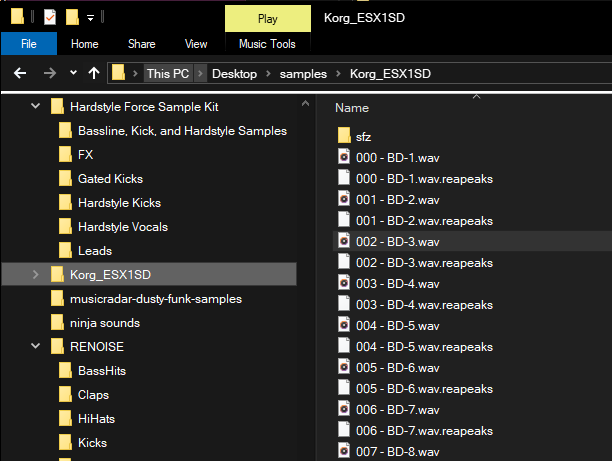

this plays short `wav` and `mp3`-files

* automatically plays when selecting a file 
* will not play files bigger then 1.5MB (currently there's no way to stop playing long files)

# Install

Just automatically start 'previewaudio.exe' during boot (by adding it to your startup items)

# Developer notes

This is an autohotkey script.

> Good luck. 
